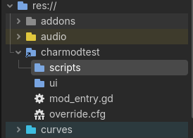

# CLAB Characters Mod (test)

Playable-character mod for [Cirno! Lifts a Boulder](https://store.steampowered.com/app/4173110/). Uses Godot 4.6's native `override.cfg` + `autoload_prepend`.

## Installation

1. Download `CharModTest-X.Y.Z.zip` from the [latest release](https://github.com/MaukWM/CLAB-Characters-Mod-Test/releases/latest)
2. Extract the zip contents into your game directory (right-click game in Steam → Manage → Browse Local Files)
3. You should see `override.cfg` and `charmodtest/` next to `Cirno! Lifts a Boulder.exe`
4. Launch the game

### Uninstall

Delete `override.cfg` and the `charmodtest/` folder from the game directory.

## Adding a character

A character is a folder under `charmodtest/characters/` with a `character.json` in it - no code
needed. The folder name is the id:

```json
{
	"display_name": "Marisa",
	"stats": {
		"jump_impulse_immediate": 21.0
	}
}
```

`stats` takes any exported property on the player. A character can also carry abilities and switch
off ones the game gives Cirno.

- [docs/CHARACTERS.md](docs/CHARACTERS.md) - every property that can be set, and the ones that must be set in pairs
- [docs/ABILITIES.md](docs/ABILITIES.md) - writing an ability, adding vs replacing the game's own
- [docs/GAME-NOTES.md](docs/GAME-NOTES.md) - what the mod relies on inside the game, for when a patch breaks it

## Development setup

From the repo root:

```powershell
powershell -ExecutionPolicy Bypass -File tools\dev-link.ps1
```

`charmodtest/` now shows up inside the decomp project and the Steam install as a junction - the folder
Godot edits *is* this repo. Open the decomp in Godot and it looks like this:



Launch the game (F5). On success the Output panel prints:

```
CharModTest: Mod initializing...
CharModTest: All systems ready.
```

It finds the decompiled project and the Steam install on its own - folder names don't matter. Pass
`-Decomp` / `-SteamDir` if it can't, or `-SkipSteam` / `-SkipDecomp` for one environment only.

Undo with `tools\dev-unlink.ps1`.

## License

MIT
